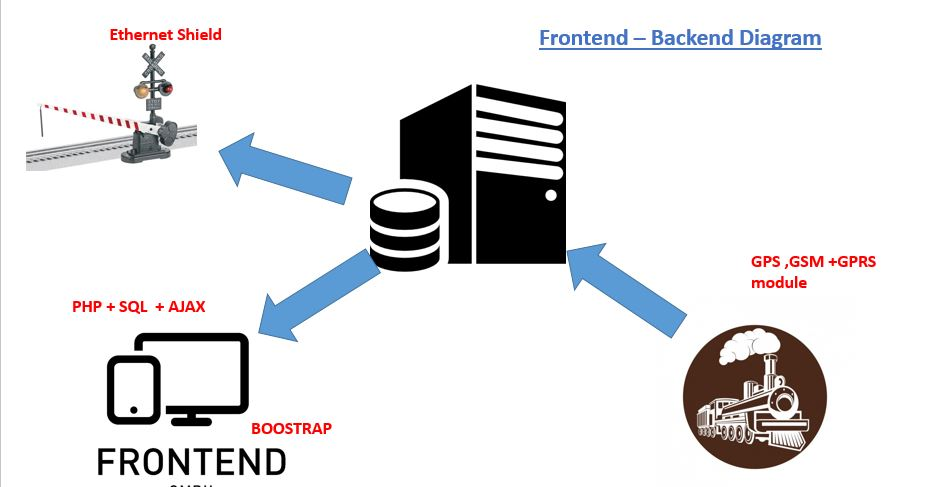

[comment]: # "This is the standard layout for the project, but you can clean this and use your own template"

# Train Movement Tracking and Level-Crossing Safety Control

---

## Team
-  E/14/213, MAHALIYANA R.K., [e14213@eng.pdn.ac.lk](mailto:e14213@eng.pdn.ac.lk)
-  E/14/136, HETTIARACHCHI H.A.D.C., [e14136@eng.pdn.ac.lk](mailto:e14136@eng.pdn.ac.lk)
-  E/14/125, HASSANA A.L.F., [e14125@eng.pdn.ac.lk](mailto:e14125@eng.pdn.ac.lk)

## Table of Contents
1. [Introduction](#introduction)
2. [Solution Architecture](#solution-architecture )
3. [Hardware & Software Designs](#hardware-and-software-designs)
4. [Links](#links)

---

## Introduction

Our project is to built a monitoring system for railways. In SriLanka, there is a traditional system to monitor trains in most of the stations. Usually from one station, they issue a device to the train and once that train reached to another station, train driver has to give that old device and get a new device from the newly reached station. Because of that, that train can be only monitored by the stations which are located along its path. So we intend to develop a system which can monitor all the trains from any where. As a feature of our system, we'll add a railway gates controlling part. 

  

## Solution Architecture

Our system has a centralized sever. It monitors the trains and controls the gates. There are separate devices for those tasks. Basically we use GPS to get the locations of trains and continuous internet connection to feed the data to the server. If something happens to the GPS signals, there is a failsafe sensor for that. That sensor will trigger the gate controlling device when the train is in right position. That is how our system works.  

## Hardware and Software Designs

The GPS module that we are using for the project is Adafruit Wearable Ultimate GPS Module. The images will show you how its configured and the output.  
  
  
  
We have created a website for upload data and monitor the train. We hosted that website in 000webhost.com . 

This is the [link](https://trainlocationviewer.000webhostapp.com) for that site.  

  
  

[How our site works](https://youtu.be/p51krXkC2GI)  
[Process](https://youtu.be/yUq7oLuPGLU)  
  
[Project Report](data/documents/1.pdf)

## Links

- <a href = "https://github.com/cepdnaclk/e14-3yp-Train-Movement-Tracking-and-Level-Crossing-Safety-Control" target = "_blank">Project Repository</a>
- <a href = "https://cepdnaclk.github.io/e14-3yp-Train-Movement-Tracking-and-Level-Crossing-Safety-Control/" target = "_blank">Project Page</a>
- <a href = "http://www.ce.pdn.ac.lk/" target = "_blank">Department of Computer Engineering</a>
- <a href = "https://eng.pdn.ac.lk/" target = "_blank">University of Peradeniya</a>

[//]: # (Please refer this to learn more about Markdown syntax)
[//]: # (https://github.com/adam-p/markdown-here/wiki/Markdown-Cheatsheet)
